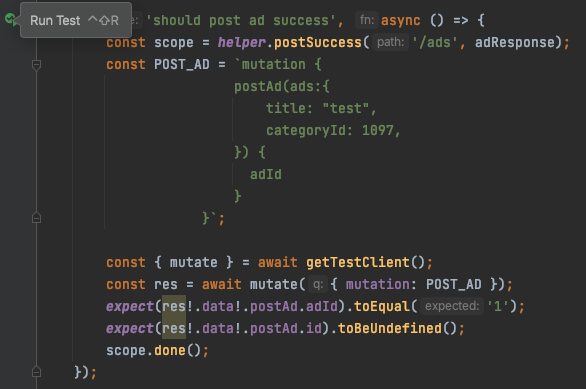

# Typescript

### Summary

In most of the project for FE, we current totally use \`typescript\`. There are several reason:

1. after adding the type, you don't need to read the function and know the return value structure
2. it could help to catch the error early and make the code more reliable
3. It would finally convert to js

From the [trends](https://www.npmtrends.com/typescript):

.png>)

It is clear that more and more project are using typescript. So I would highly recommend to use typescript in your project in the future.


### Set up

To adding the typescript support to current project:

```bash
npm i typescript --save-dev
```

After the typescript install to the project, also add the `tsconfig.json` file in your project with:

```json
{
  "compilerOptions": {
    "target": "es5",
    "module": "commonjs",
    "strict": true,
    "outDir": ".dist",
    "sourceMap": true
  }
}
```

### How to use

Let's create a file called `index.ts`  and adding the code like:

```typescript
interface MyType {
    field1: string;
    field2: string;
}


const add2Fields=({field1, field2}:MyType):string => {
    return `${field1}, ${field2}`;
}

console.log(add2Fields({field1:'hello', field2:'world'}));
```

&#x20;on command line run:

```bash
npx tsc index.ts
```

you will find `index.js` file has been compiled:

```javascript
var add2Fields = function (_a) {
    var field1 = _a.field1, field2 = _a.field2;
    return "".concat(field1, ", ").concat(field2);
};
console.log(add2Fields({ field1: 'hello', field2: 'world' }));
```

Actually, in our daily developing, we add the command in `package.json`  such as:

```json
{
...
  "scripts": {
    ...
    "build": "tsc"
  },
}
```

then we run the command:

```bash
npm run build
```

The compiled files could be revealed in \`.dist\` folder:



and you can run the script by:

```bash
node .dist/index.js
```

The `dist` folder could also be pushed to `npm` registry.


### Run Typescipt directly

In develop environment, we don't really need to compile `ts` to `js` and to see the finally result. What we need to do is direct use `ts-node`  to run the file.

```bash
 npm i ts-node --save-dev
```

The line above could install the ts-node engine, this engine would loading the ts file directly to memory and compile it.

```bash
npx ts-node index.ts
```

to run the index ts file by the line above.

### Reference

1.[https://www.typescriptlang.org/](https://www.typescriptlang.org)

2\. [https://www.npmtrends.com/typescript](https://www.npmtrends.com/typescript)

3\. [https://github.com/TypeStrong/ts-node](https://github.com/TypeStrong/ts-node)


